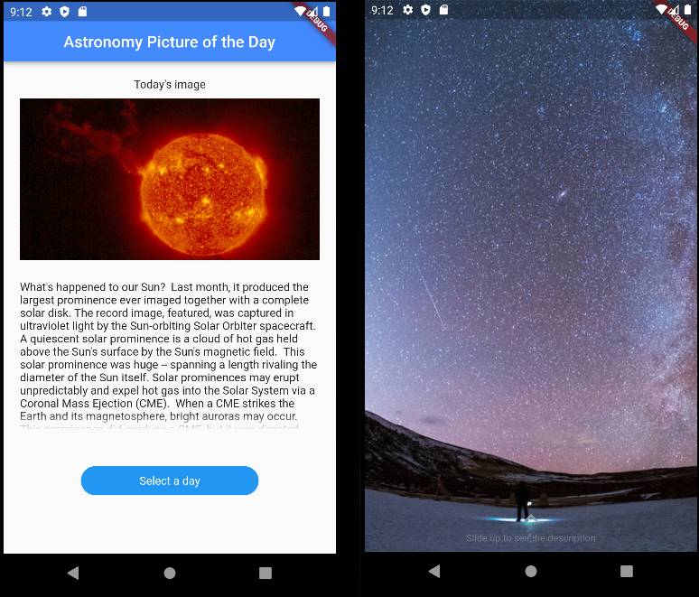

# nasa_picture_of_the_day

### A flutter project to practice Clean architecture and TDD. 

It uses NASA's API to retrieve the APOD (Astronomy Picture of the Day).

Based on [Leticia Baleiro](https://github.com/LeBaleiro/) clean architecture and tdd video series, her repository can be found in [here](https://github.com/LeBaleiro/nasa_clean_arch_null_safety)

### License

